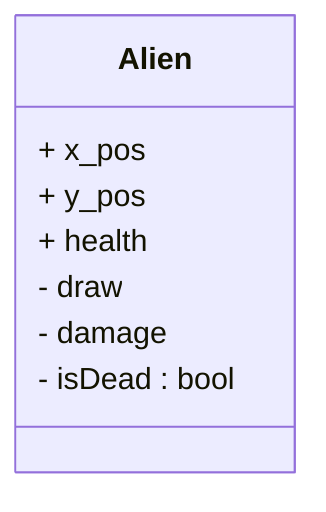

# Luhan's Planning for the aliens

So I want to have the alien object, and this object needs to have methods for: 
- Drawing the alien if it is alive
- Checking if the alien is alive

This dataclass looks like: 

