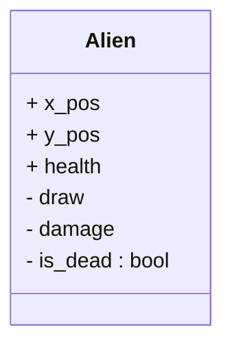

# Luhan's Planning for the aliens

So I want to have the alien object, and this object needs to have methods for: 
- Drawing the alien if it is alive
- Checking if the alien is alive

This dataclass looks like: 

# Level Logic
I want there to be 10 levels before hitting fat ouk. After killing fat ouk, you have the chance to play endlessly or you can quit. 

Level 01 -- baseline
Level 02 -- More Enemies
Level 03 -- Move faster
Level 04 -- Enemies have more health
Level 05 -- Spawn faster
Level 06 -- More enemies
Level 07 -- Move faster
Level 08 -- Enemies have more Health
Level 09 -- Move Faster
level 10 -- Fat Ouk

I will implement this as: 
Level: Set base conditions outside the loop
Call an "increase level" function
- If odd, change the speed
    - If L %% 5, increase spawnrate
    - Else increment step
- If even, change the amount
    - If L in series (4l + 2), increase amount of enemies spawned. 
    - If L not in series, increase the health of enemies. 

After level ten: 
- Every 2 odd Levels increase the health of the enemies
- Every 2 even levels make the enemies faster
- Every 10 levels spawns a fat ouk. 

## Fat Ouk Implementation
- Large target - 3-5x the size of a regular enemy
- Shoots missiles back at the player from two turrents. 
- Does not move down or damage the moon base
- Has `math.floor(level ** 1.1)` health

