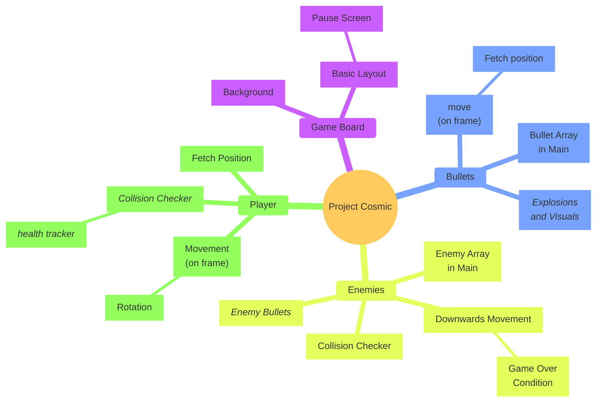

# 10 April 2026

> Meeting 1 | Jovan, Francois, and Luhan present. 

## Overview




**Delegations**:
- Luhan will handle the game board & the enemies
- Jovan will handle the Player controller & related functions
- Francois will handle the bullets code

**Due date**:
- All primary objectives must be delivered by 17 April
- All *secondary objectives* must be evaluated again on the 17th April, with the goal to implement them by the 14th April. 

## File Storage
Luhan will create a github repo and help the others initialize it. Code will be stored and worked on here. Each member will have a folder with their name on it, in which their code will be stored. They can create files & classes as they would like. 

```Directory
Repository/
├─ Meeting Minutes/
│  ├─ ...
├─ Luhan/
├─ Luhan/
│  ├─ enemy.py
├─ Jovan/
│  ├─ player.py
├─ Francois/
│  ├─ bullet.py
├─ project_cosmic.py
├─ README.md
```

We can then import any classes that we need from eachother's work. 

> [!note] Remember
> Code you write must be traceable to you, even if it is outside your folder. If you work on a piece of code, write a comment with what you have done. 
> 
> ```python
> # Luhan | Created this function to blow things up 
> def blowup():
> 	return "kaboom"
> ```


## Implementation Details

The main class will run a loop that will keep the game around 24fps. 
This loop will call the classes that
- Handle the player character's movement & input
- Handle the continuous movement of bullets
- Handles the spawning of enemies on some set number of frames. 
- Handles the collision logic of different objects on screen
- Which draw the board to the screen

Each function called *must draw objects within that class*. That is; the translation of the bullets will appear like the pseudocode example below. This is the rough structure for objects that need to be written to screen. 
```python
# In Main Function
Bullet.move()

# In Definition - Pseudo-implementation
def move():
	x += vx
	y += vy
	draw()
```
### Player Character
- Move left/right
- Rotate CCW and CW
- Stop movement & rotation
- Shoot on keypress or interval

The player character must initialise a bullet using a method provided by the bullet object. The implementation discussed is `Bullet.createBullet(x, y, theta, v)`. 


## Extra Effects
A list of extra effects we can implement (which has not been planned – but feel free to take initiative)

- Sounds
- Graphics
	- Collisions
	- Sprites
- Scoring & High-scores
- Multiplayer
- Instructions Page
- Powerups
- Visual styles
